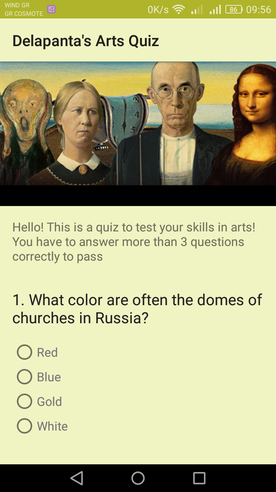

<h1>Quiz App</h1>

This app is a small art quiz, which implemented as project during udacity 's nanodegree program courses.
There are six questions and you have to answer correctly more than three, in order to win.
The answers layout are radio buttons, check boxes and simple text (edittext).

Enjoy! :smile:

<h2>App's screenshots</h2>

